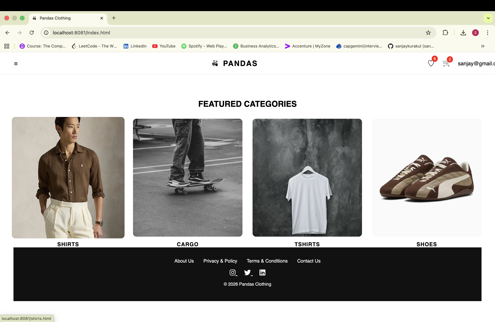
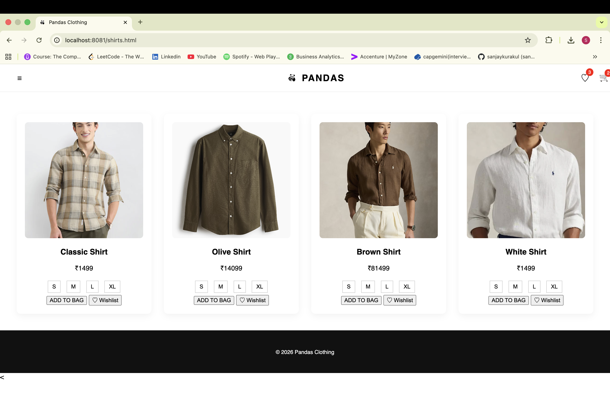
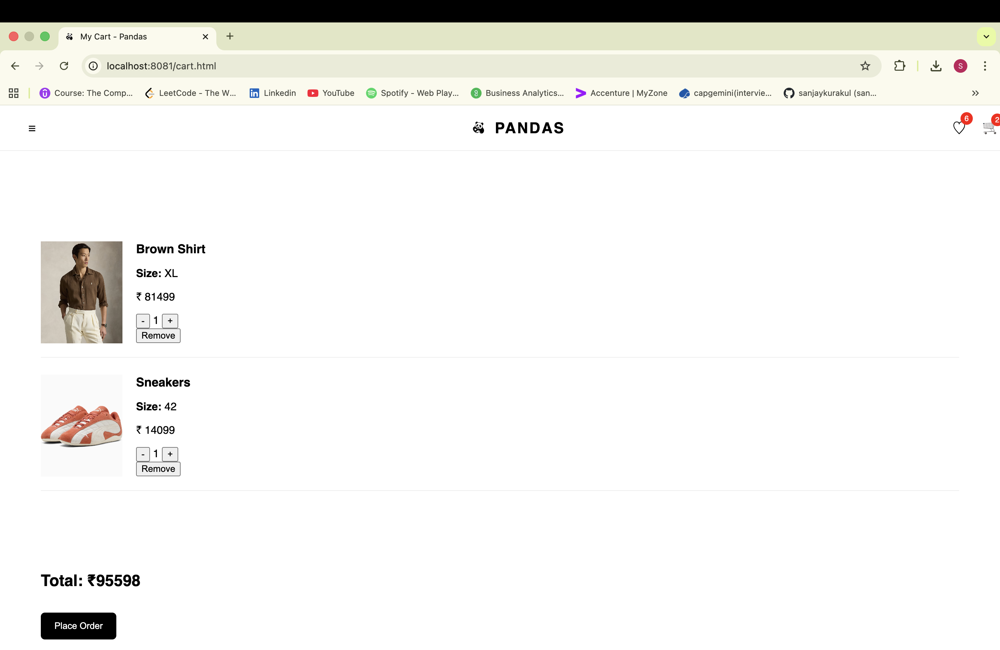
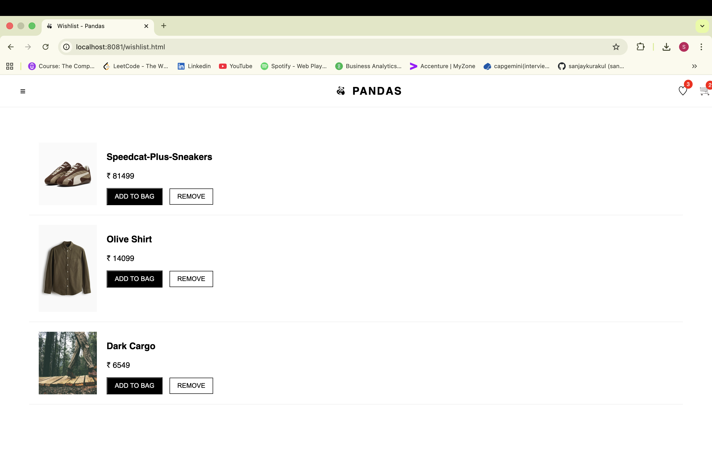
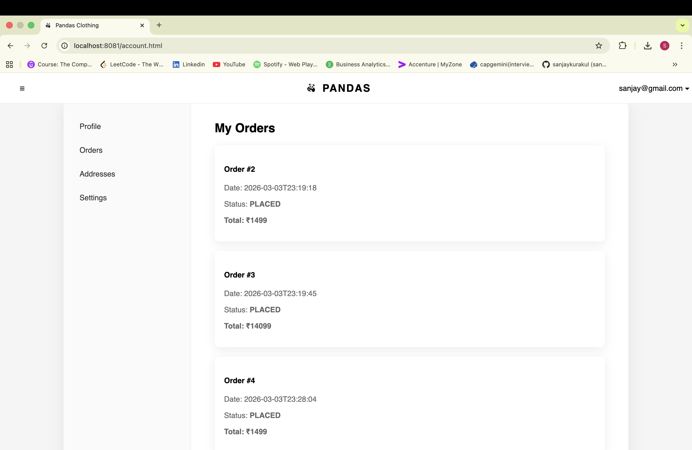
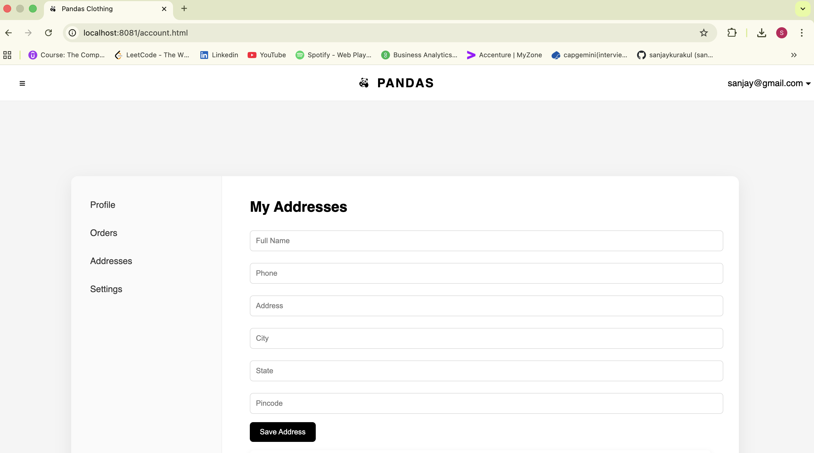
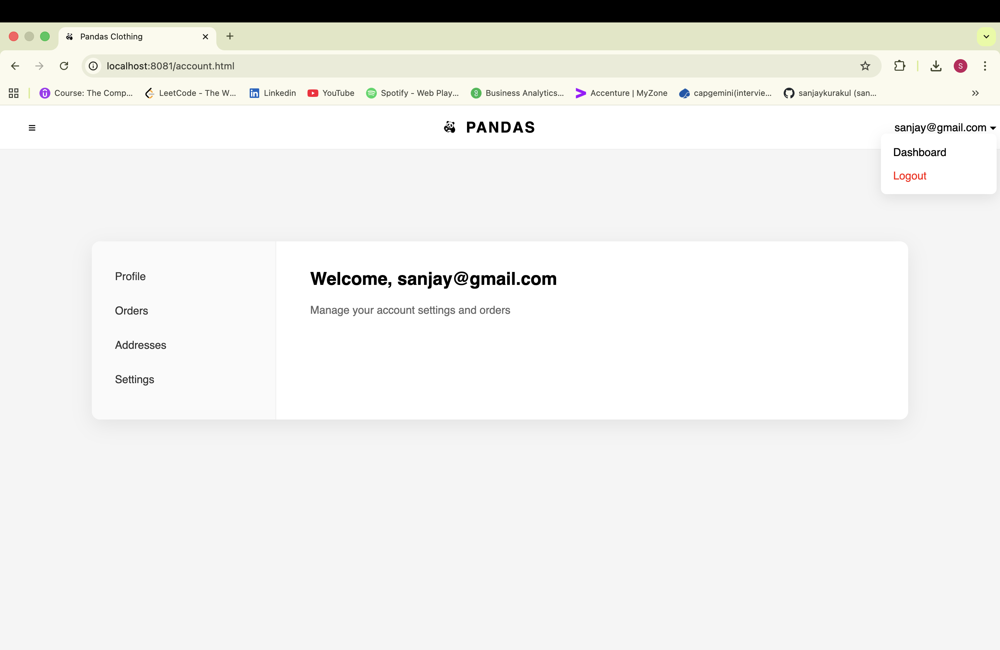

# 🐼 Pandas Clothing -- E‑Commerce Web Application

Pandas Clothing is a **full‑stack e‑commerce web application** built
using **Spring Boot, MySQL, HTML, CSS, and JavaScript**.\
The project demonstrates backend API development, database integration,
authentication, and a dynamic frontend.

Users can browse products, manage a cart and wishlist, place orders, and
manage their account dashboard.

------------------------------------------------------------------------

# 🚀 Features

## 👤 User Authentication

-   User Registration
-   Login using Spring Security
-   Password encryption with BCrypt

## 🛍 Product Browsing

-   View product catalog
-   Product images
-   Category pages

## 🛒 Shopping Cart

-   Add items to cart
-   Remove items
-   Dynamic cart count
-   Total price calculation

## ❤️ Wishlist

-   Add items to wishlist
-   Move wishlist items to cart

## 📦 Orders

-   Place orders
-   Order history
-   Order status tracking

## 📍 Address Management

-   Add address
-   Edit address
-   Save delivery address

## 👤 Account Dashboard

-   Profile management
-   Update name and phone number
-   View orders
-   Manage addresses
-   Account settings

## ⚙ Settings

-   Logout
-   Delete account

------------------------------------------------------------------------

# 🏗 Tech Stack

### Backend

-   Java
-   Spring Boot
-   Spring Security
-   Spring Data JPA
-   REST APIs

### Frontend

-   HTML5
-   CSS3
-   JavaScript (ES6)

### Database

-   MySQL

### Tools

-   IntelliJ IDEA
-   MySQL Workbench
-   Git & GitHub

------------------------------------------------------------------------

# 📂 Project Structure

    PandasClothing
    │
    ├── controller
    │   ├── AuthController
    │   ├── CartController
    │   ├── ProductController
    │   ├── OrderController
    │   ├── UserController
    │   └── WishlistController
    │
    ├── entity
    │   ├── User
    │   ├── Product
    │   ├── Cart
    │   ├── Order
    │   ├── OrderItem
    │   └── Address
    │
    ├── repository
    │   ├── UserRepository
    │   ├── ProductRepository
    │   ├── CartRepository
    │   ├── OrderRepository
    │   └── AddressRepository
    │
    ├── service
    │   └── UserService
    │
    ├── resources
    │   ├── static
    │   │   ├── css
    │   │   ├── js
    │   │   └── images
    │   │
    │   └── application.properties

------------------------------------------------------------------------

# ⚙ Installation & Setup

## 1. Clone Repository

``` bash
git clone https://github.com/yourusername/pandas-clothing.git
```

## 2. Create MySQL Database

Create database:

    ecommerce

Update **application.properties**

    spring.datasource.url=jdbc:mysql://localhost:3306/ecommerce
    spring.datasource.username=root
    spring.datasource.password=yourpassword

    spring.jpa.hibernate.ddl-auto=update
    spring.jpa.show-sql=true

## 3. Run Application

Run:

    PandasClothingApplication.java

Open in browser:

    http://localhost:8081

------------------------------------------------------------------------
## 📸 Screenshots

### 🏠 Home Page


### 🛍 Product Page


### 🛒 Shopping Cart


### ❤️ Wishlist



### 📦 Orders Page


### 📍 Address Management


### 👤 Account Dashboard



# 🔐 Security

-   Spring Security authentication
-   BCrypt password hashing
-   Protected REST APIs
-   Session-based authentication

------------------------------------------------------------------------

# 📈 Future Improvements

-   Online payment integration
-   Admin dashboard
-   Product search and filters
-   Email notifications
-   Cloud deployment

------------------------------------------------------------------------

# 👨‍💻 Author

**Sanjay Kurakul**\
Computer Science Engineering Student

GitHub: https://github.com/Sanjaykurakul

------------------------------------------------------------------------

⭐ If you like this project, please star the repository!
